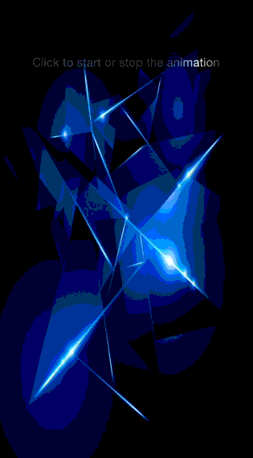

JTSlideShadowAnimation
======================


JTSlideShadowAnimation allow you to reproduce the famous "slide to unlock effect" on iOS.

## Installation

With [CocoaPods](http://cocoapods.org/), add this line to your Podfile.

	pod 'JTSlideShadowAnimation', '~> 1.0'


## Screenshots



## Usage

### Basic usage

Just import `JTSlideShadowAnimation.h`.

```objective-c
#import "JTSlideShadowAnimation.h"

@interface ViewController : UIViewController

@property (weak, nonatomic) IBOutlet UIButton *animatedView;

@property (strong, nonatomic) JTSlideShadowAnimation *shadowAnimation;

@end
```

Assign the view you want to animate and start the animate.

```objective-c
- (void)viewDidLoad
{
    [super viewDidLoad];
 
    self.shadowAnimation = [JTSlideShadowAnimation new];
    self.shadowAnimation.animatedView = self.animatedView;
}

- (void)viewDidAppear:(BOOL)animated
{
    [super viewDidAppear:animated];

    [self.shadowAnimation start];
}
```

### Customization

You can easily customize the animation.

- `shadowBackgroundColor`
- `shadowForegroundColor`
- `shadowWidth`
- `repeatCount`
- `duration`

Example:

```objective-c
- (void)viewDidLoad
{
    [super viewDidLoad];
 
    self.shadowAnimation = [JTSlideShadowAnimation new];
    self.shadowAnimation.animatedView = self.animatedView;

    self.shadowAnimation.shadowBackgroundColor = [UIColor colorWithWhite:0. alpha:.3];
    self.shadowAnimation.shadowForegroundColor = [UIColor blackColor];
    self.shadowAnimation.shadowWidth = 40.;
    self.shadowAnimation.repeatCount = 3;
    self.shadowAnimation.duration = 3.;

    [self.shadowAnimation start];
}
```

## Requirements

- iOS 7 or higher
- Automatic Reference Counting (ARC)

## Author

- [Jonathan Tribouharet](https://github.com/jonathantribouharet) ([@johntribouharet](https://twitter.com/johntribouharet))

## License

JTSlideShadowAnimation is released under the MIT license. See the LICENSE file for more info.
